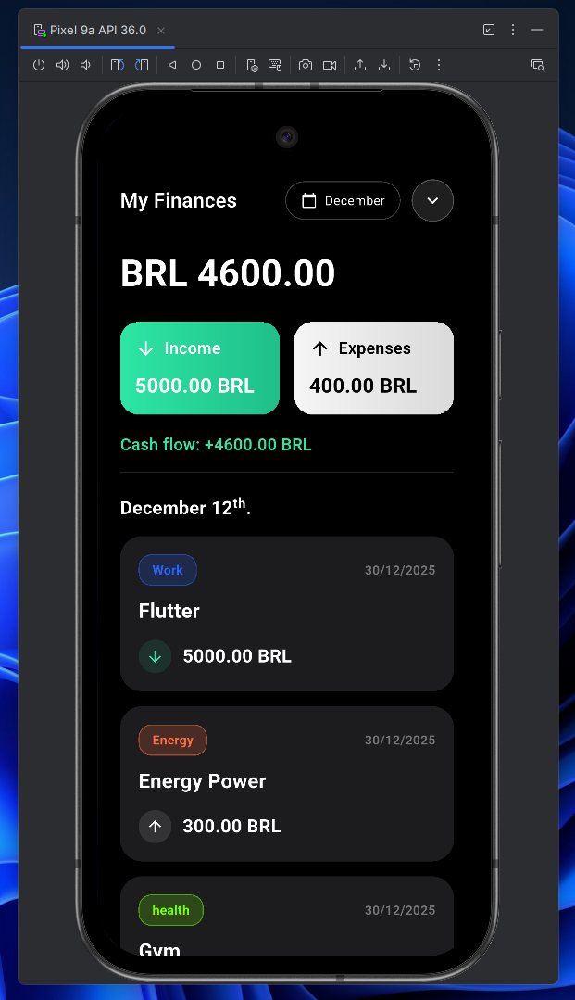
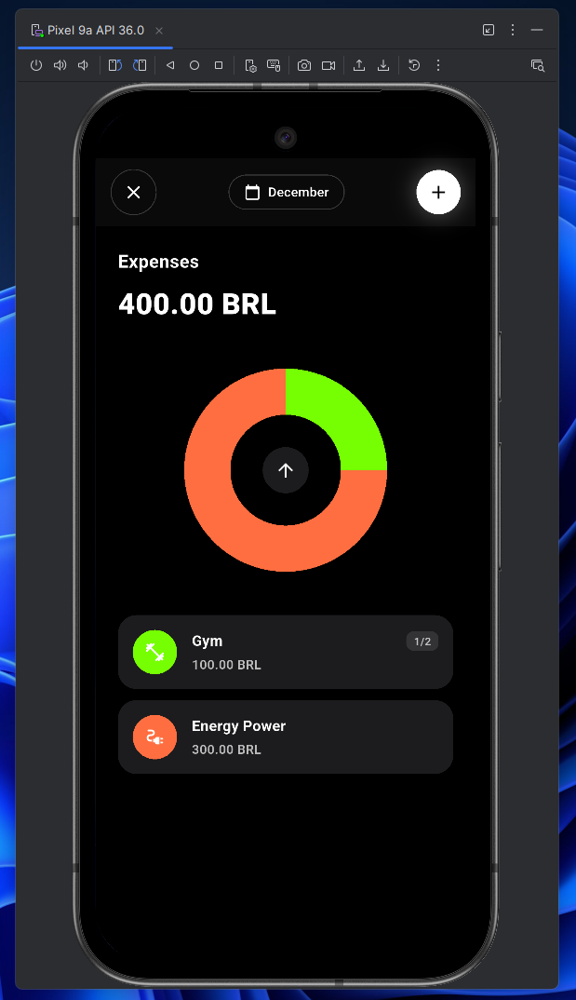

# 📱 Finantials: Personal Finance Manager

**Product Engineering Showcase:** A personal finance manager developed from scratch to solve a local domain problem: adapting budget control to the **Brazilian financial reality** (monthly cycles and credit card installments). Designed to be 100% offline, private, and minimal.

### 🎥 Watch the Demo (English)
I recorded a full walkthrough explaining the product vision, the features, and the "why" behind the architectural decisions.

---

### 📸 UI & Analytics

  
  

---

### 🏗️ Architectural & Product Decisions

* **Domain-Driven Context (Brazil):** Business logic built entirely around **monthly billing cycles** rather than daily/annual budgets, natively handling complex credit card installments ("Compras Parceladas") across future months.
* **Privacy by Design (Offline-First):** Powered by **Hive (NoSQL)**. Because financial data is highly sensitive, the architecture ensures data never leaves the device. No external APIs, no cloud tracking.
* **State Management:** Opted for native `ValueListenableBuilder` to keep the application lightweight and reactive, avoiding heavy boilerplate from external state management libraries for local data.

### ✨ Key Features

* **📝 Full Control:** Add, edit, or delete any transaction easily.
* **📊 Visual Analytics:** Interactive charts for both **Income** and **Expenses** to track cash flow using `fl_chart`.
* **🌑 UI/UX Focus:** Dark Mode and an immersive interface designed for frictionless daily usage.

---

> 💡 **Portfolio Note:** This project is maintained as a showcase of end-to-end product engineering, from identifying a real-world problem to delivering a functional architectural solution. It also serves as a demonstration of technical communication in English.
